# Oh Glorious Maths

- **Discretizing** a pdf: $f(x) dx = \mathbb{P}[x \leq X < x + dx]$
- **Combinatorics**: How many unique pairs from $5$ can you choose:
  - $5 \choose 2$ is


- **Permutations**: 3! = 3 * 2 * 1. How many permutations can you have? Suppose you have a banana, an apple, and a carrot. You can eat them in the following sequences: ABC, BAC, CAB, ACB, BCA, CBA; i.e. 6 in total. You start off by choosing when to eat an apple, three possibilities (you eat it first, second or third), once that is chosen, you have two possibilities of choosing when to eat a banana (if you decided to eat an apple first, then banana can be second or third; if you decided to eat an apple second, then banana can be first or last; if you choose to eat an apple last, then banana can be first or second; i.e. in each case, you have two options). Finally, once the order of eating an apple and banana is chosen, there is only one position for a carrot. Eat your veggies. 

- $f(x) \sim g(x)$ means $\lim_{x \to a} \frac{f(x)}{g(x)} = c$

- $\log_{b}(a) = c \iff b^c = a$

- **Big-O** sorted (from fastest to slowest; big o is the asymptotic runtime): $\mathcal{O}(1)$ (constant time), $\mathcal{O}(\log N)$ (log time; divide and conquer), $\mathcal{O}(N)$ (linear time), $\mathcal{O}(N \log N)$ (merge search), | $\mathcal{O}(N^2)$ (quadric time), $\mathcal{O}(2^N)$ (exponential time; going through all of the subsets of a set), $\mathcal{O}(N!)$ (finding all permutations of a string), $\mathcal{O}(\infty)$ (flipping coin). Useful <a href='https://www.youtube.com/watch?v=zUUkiEllHG0&t='>video code examples</a>. 
  - Definition: for some $n \geq n_1$, $f(n) = \mathcal{O}(g(n))$ means: $|f(n)| \leq c|g(n)|$ for some $c \in \mathbb{R}$
  - some properties. $\mathcal{O}(c + n) = \mathcal{O}(n)$ for some $c > 0$.
  - $c \mathcal{O}(n) = \mathcal{O}(n)$
  - example. Nested loop. `for (i=0; i<n; i++) { for (j=i; j<n; j++) }`. Notice that the inner loop runs:
    $n, n-1, n-2, ..., 3, 2, 1$ number of times. This is $n(n+1)/2$. Thus $\mathcal{O}(n^2)$
  - Imagine you have a sorted array. This is log time. Divide and conquer

- How many times can you split 32 into even parts? $2^5$, $5$ times. $\log_2 (32) = 5$, that is why divide and conquer is $\mathcal{O}(\log n)$. Merge sort is $\mathcal{O}(n \log n)$ because you also do $\mathcal{O}(n)$ operations when mergin sorted arrays. (check out the code in the python scripts folder and the exercise below).

- In base 10, a fraction converts to a terminating decimal if and only if the denominator only has prime factors of 2 and 5.

- Integrating wrt. to a function:

  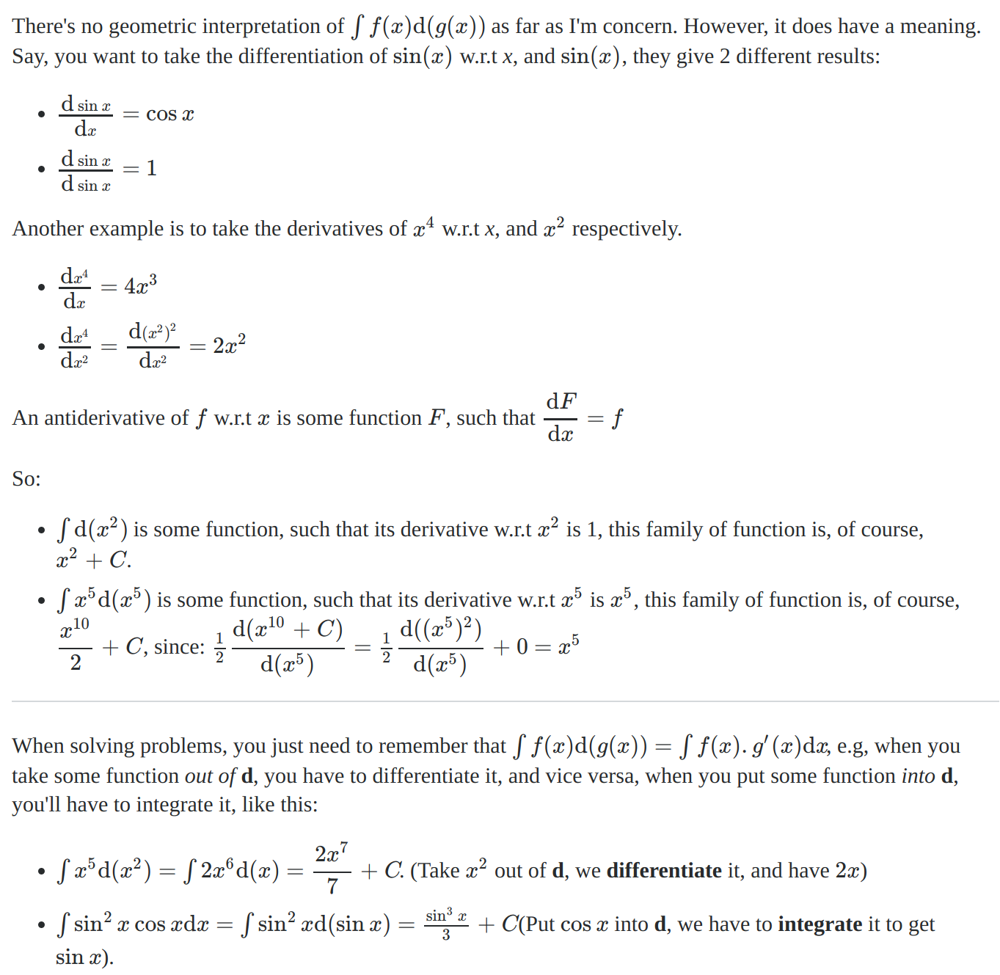

  $$\frac{dF(x)}{dx} = f(x) \\ dF(x) \sim f(x) dx$$

  $$\int dx^2 = ?$$

  If $dF(x) = dx^2$, then $F(x) = x^2$, thus $\frac{dF(x)}{dx} = 2x$ and so

  $$dF(x) = 2x dx$$, so $\int dx^2 = \int 2x dx = x^2 +c$. Keep in mind that $\frac{dF(x)}{dx} = \lim\limits_{h \to 0} \frac{F(x+h)-F(x)}{h}$ in a rigorous sense. So multiplying by $dx$ is slightly weird. But in an equivalent sense, makes more sense. Therefore:

  $$\int f(x) d(g(x)) = \int f(x) \cdot g'(x) dx$$

  Motivating example from the SO answer:

  $$\int \sin^2 x \cos x dx = \int \sin^2 x d(\sin x) = \int u^2 du = \frac{u^3}{3} + c = \frac{\sin^3 x}{3} + c$$

# Oh Glorious CS

- LIFO vs FIFO
  - LIFO: 1 -> 2 -> 3. [1, 2, 3]. Last in is 3, it is the first out. Then 2. Then 1.
  - FIFO: 1 -> 2 -> 3. [1, 2, 3]. First in is 1, it is the first out. Then 2. Then 3.

- Data Structures:

  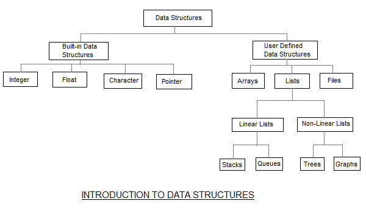

- Stack - an abstract data type. Follows LIFO pattern. 

  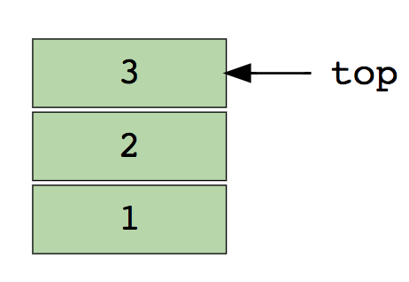

  - basic operations are: pop, isEmpty, peek/top, push

- Queue - also a linear abstract data type like a stack. This is literally a queue. FIFO. You push to the back and pop from the top. Unlike stacks where you push to the top and pop from the top. Common operations: enqueue (inserts an element to the back), dequeue (removes an element from the start of the queue), isEmpty, top

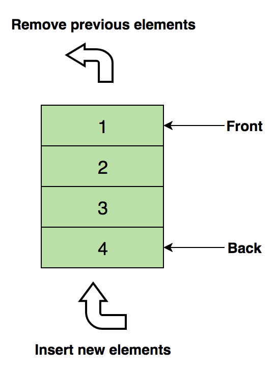

- Linked List

  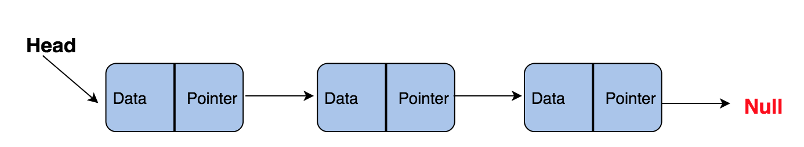

  - *InsertAtEnd* — Inserts given element at the end of the linked list
  - *InsertAtHead* — Inserts given element at the start/head of the linked list
  - *Delete* — Deletes given element from the linked list
  - *DeleteAtHead* — Deletes first element of the linked list
  - *Search* — Returns the given element from a linked list
  - *isEmpty* — Returns true if the linked list is empty

- Graph

  Is a collection of nodes/vertices connected through edges.

  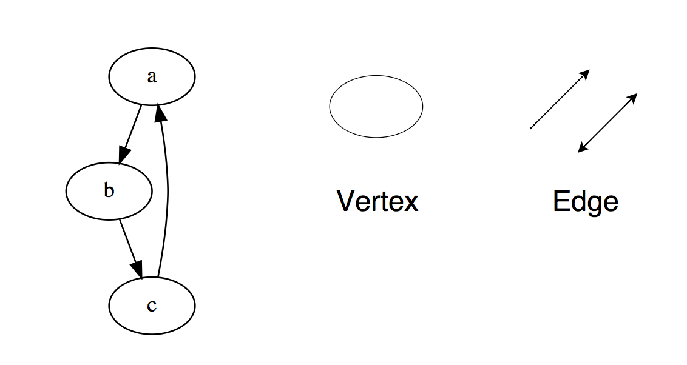

  A graph can be represented either through adjacency list or a matrix:

  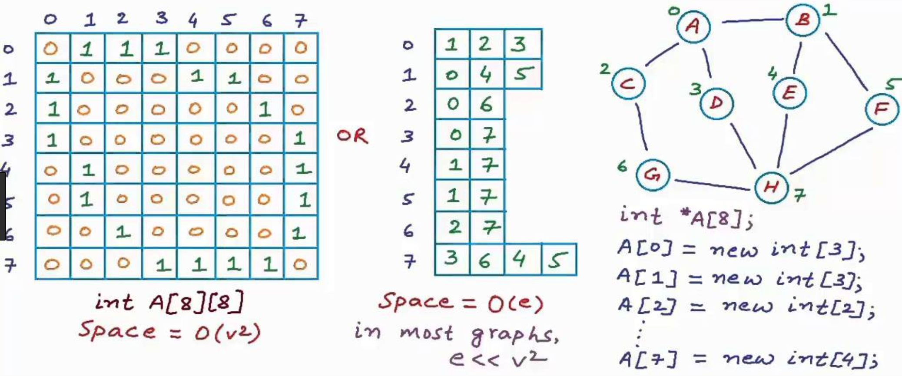

  BFS and DFS algorithms taken from <a href="https://medium.com/basecs/breaking-down-breadth-first-search-cebe696709d9" alt="credit for: 'https://medium.com/basecs/breaking-down-breadth-first-search-cebe696709d9'">Medium</a>:

  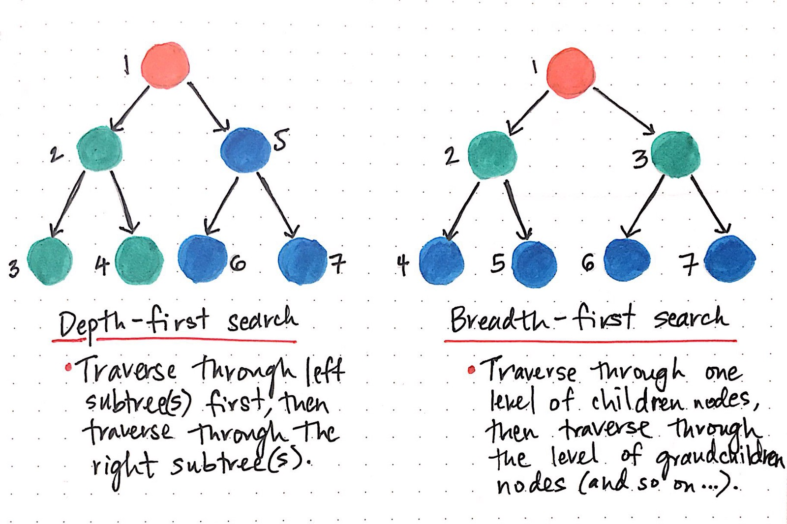

- Tree

Is a hierarchical data structure with nodes and edges. The key difference to graphs is that it does not contain cycles.

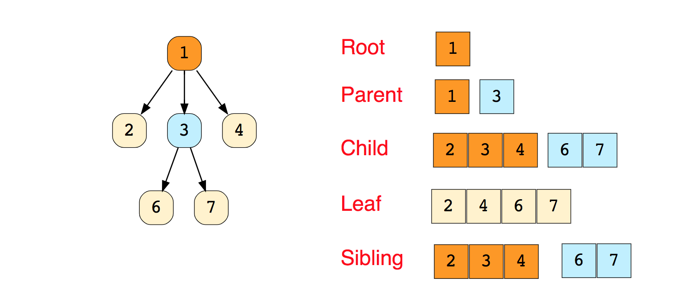

Types of trees: N-ary, Balanced, Binary, Binary Search, AVL, Red Blac, 2-3. The most commonly used are Binary and Binary Search. A Binary Tree node contains following parts.

1. Data
2. Pointer to left child
3. Pointer to right child

- Trie
- Hash Table


### Time and Space complexities of data structures


# Oh Glorious Cool Commands

- To run interactively your `.py` file in the terminal: `$python -i file.py`. 
- `git remote set-url origin git@github.com:nazariyv/node_learn.git`

for sshing

- ```python
  'foo {}'.format('bar') # uses str to print
  'foo bar'
  'foo {!r}'.format('bar') # uses repr to print
  "foo 'bar'"
  ```

<<<<<<< HEAD
- For shell evaluation piping:

  `$( env | grep 's[0-9]' )`
=======
- To make a directory and cd into it:

  ```
  mkdir context-manager && cd $_
  ```

  `$_` is the most recent command, in this case `context-manager`. `&&` is here for chaining purpose, i.e. if `mkdir` command fails -> do not cd.


# VIM Remembers

- To split the window: `:vsplit` or `:split`. To navigate: `Ctrl + W` and arrow key, or `Ctrl + W, W`

- To create a new tab: `:tabnew billion_dollar_code.py`

- To have vim code and console: use `tmux`

- To comment block: `Ctrl + v` -> select where you want the comment, `I`, then write `#`, now press: `Esc`.

- To duplicate the line: `yy` or `Y`.

- To copy: `y` to past after cursor: `p`, before: `P`.

- To insert text on the line below: `O`

  
>>>>>>> a2217dadb8cd5c5112bcfbc4c8bd79e3ec918e64

# I am Expert Python Programmer


Real lessons from the PyData 2017 - James Powell lesson:
Python is the language oriented around protocols
There is some behaviour, some syntax, some byte-code or some top-level
function and there is a way for you to tell Python how to implement that
on an arbitrary object via underscore methods. The exact correspondance
is usually guessable, but if you cannot guess it:
google python data-model and you will find all the different methods and
all of the caveats of their use.
Python is a very simplistic language in terms of its execution model.
Code runs from toop to bottom
And things which would not be executable statements in other languages
like class statements, function definitions or generator definitions
are actually executable code in Python
Because it's executable code, not only can you hook into them
but you can define functions within functions base off the runtime
data. Define classes withing functions based off some runtime
information you have about them
How these impace specific features?
Metaclasses - some hook into the classes construction process.
Because classes are constructed in run-time, you hook right into
them. And because you can hook into subclass creation, you can ask it
some questions like: "Do you have these methods implemented?"
But the meaning behind it is quite simple. You have the library code
and you have user code. When you sit on the library side, how
do you make sure that the users don't screw up. How do you enforce
the constraint from the library code to the user code.
All that it takes is some way to hook into the process of how
user classes are instantiated. That's merely what the metaclass is.
In Python standard library there are solutions to these.
In ABC there is an ABC metaclass there are decorators to mark
the methods and abstract methods so that you do not have to write
the metaclass yourself.
Generators - is a way to take a computation that would otherwise run eagerly

from the injection of its parameters to final computation and interleave
it with other code by adding yield points where you can yield the
intermediate values or one small piece of computation and also yield
back the control to the caller. In that vein you can thinkg about
the generator as the one long code and break it into small parts
where you run small sub units of computation, where the user can step in
and do whatever they want
Context Managers - a way to take set up action and tear down action
and ensure that they happen in concordance with each other. If Set up
action occurs, ensure that teard down action occurs, even if there is an
error somewhere.
Remember what the features are and what they are for! That is the most
important thing.

# Maths Exercises

1. Prove that the sequence:

$$1, \frac{1}{2}, \frac{1}{3}, \frac{2}{3}, \frac{1}{5}, \frac{3}{4}, \frac{1}{7}, \frac{4}{5}, ...$$ 

does not have a limit. The genral formula for the above is:

$$x_n = \begin{cases} 1/n &\text{ for n=2k-1} \\ n/(n+2) &\text{if n=2k}  \end{cases}$$

Solution:

The definition of a limit is that there is a finite number of elements in an epsilon of the neighbourhood of a limit. So say for example that $\lim x_n = l$, then for some $\epsilon > 0$, there is a finite number of sequence elements outside of the **interval** $(l -\epsilon, l + \epsilon)$:

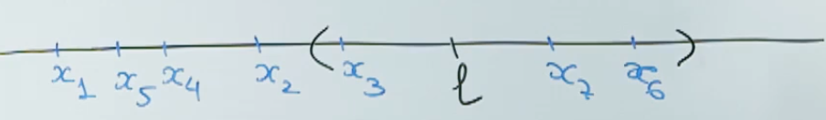

If, however, we have two limits, i.e. $\lim 1/n = 0$ and $\lim n/(n+2) = 1$, then there we be infinitely many elements in the neighbourhood of 0, as well as 1. So whatever epsilon neighbourhood we pick, there will not be finitely many elements of sequence outside of it. And therefore, the sequence in the problem does not have a limit.

# Oh Glorious Problems (not exercises)

- **Remember**: logic is king. Make small sound logical steps when solving anything. If every step is correct, you will arrive at a solution. Do not get discouraged if you fail. Sometimes you need to try a number of approaches to solve a problem.

  

  1. A census-taker knocks on a door, and asks the woman inside how
     many children she has and how old they are.
     "I have three daughters, their ages are whole numbers, and the product of the ages
     is 36," says the mother.
     "That's not enough information," responds the census-taker.
     "I'd tell you the sum of their ages, but you 'd still be stumped."
     "I wish you 'd tell me something more."
     "Okay, my oldest daughter Annie likes dogs."
     What are the ages of the three daughters? 

  2. Are $\mathcal{O}(2^n)$ and $\mathcal{O}(2^{2n})$ equivalent?

  3.  How to test if the data is normal?

     Solution:

     - Visual methods: q-q plot, histogram (bell shaped), box plot, p-p plot.

       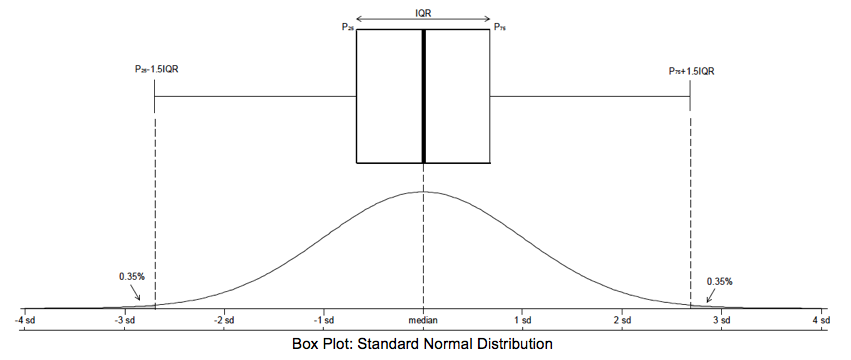

     - Normality tests: 

       1. Kolmogorov - Smirnov test.

          The empirical distribution function, $F_n$ for $n$ iid ordered observations $X_i$ is defined as $$F_n (x) = \frac{1}{n} \sum_{i=1}^n I_{[-\infty, x]} (X_i)$$. i.e. this is a step function. Also, $I_{[-\infty, x]}(X_i)$ is the indicator function, equal to $1$ if $X_i \leq x$ and equal to $0$ otherwise.

          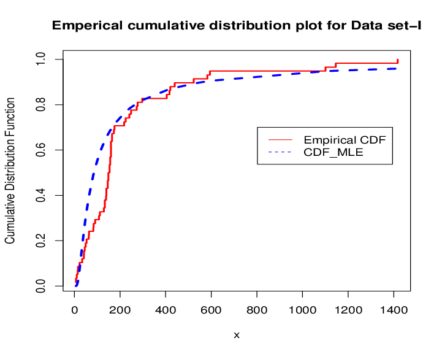

          So at each observation, the step function increases by $1/n$.

          The Kolmogorov - Smirnov statistic for a given cumulative distribution function $F(x)$ is $$D_n = \sup\limits_{x} |F_n (x) - F(x)|$$. 

          

          By the Glivenko-Cantelli theorem, if the sample comes from distribution $F(x)$, then $D_n$ converges to $0$ almost surely (if the probability of the limit is $1$). i.e. the largest absolute discrepancy between the sample empirical distribution function and the theoretical CDF will be zero as $n$ goes to infinity. In practice, this statistic required a very large number of data points (in comparison to other goodness of fit criteria). The null hypothesis is that empirical and theoretical are of the same distribution family. Note that this can also be used to test if two empirical sets of data come from the same distribution:

          $$D_{n,m} = \sup\limits_{x} |F_{1,n}(x)-F_{2,m}(x)|$$

       2. Anderson-Darling test.

          The Anderson-Darling and Cramer-von Mises statistics belong to the class of quadratic EDF statistics. If the hypothesized distribution is $F$, and empirical (sample) cumulative distribution function is $F_n$, then the quadratic EDF statistics measure the distance between $F$ and $F_n$ by

          $$n \int_{-\infty}^{\infty} (F_n(x) - F(x))^2 w(x) dF(x)$$. Where $w(x)$ is a weighting function. If $w(x) = 1$ this is Cramer-von Mises test. If $w(x) = [F(x)(1-F(x))]^{-1}$, this is Anderson-Darling statistic:

          $$A^2 = n \int_{-\infty}^{\infty} \frac{(F_n(x) - F(x))^2}{F(x) (1- F(x))}dF(x)$$, here is an illustration of the weights at tails:

          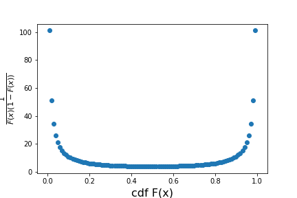

     For more <a href="https://www.ncbi.nlm.nih.gov/pmc/articles/PMC3693611/">answers</a>.

  4. Show that a set is convex if and only if its intersection with any line is convex. Show that a set is affine if and only if its intersection with any line is affine.

     

  5. Say you are on a game show [historical sidenote: this question was first played on the 60s American game show Let's Make a Deal, hosted by Monty Hall], and there are three closed doors. Behind one door is a car, the prize you dream of, and behind the other two are goats. You pick a door. The host, who knows what's behind each door, opens another which reveals a goat. Now, the host lets you make another choice: should you stick with you first door choice, or should you switch and pick a different door, in order to win the car?

     Solution:

     

# Exercises (Finance)

1. I don't know anything about bond pricing, but I've heard people use something called the discount rate when they price bonds. Can you explain what this "discount rate" is? Why is it important? Where do I get its value? What is the current discount rate (as of today)? When I price a 30-year bond, should I use today's discount rate or should I use a different discount rate for each of the next 30 years?

# Problems (CS)

**Arrays**

1. Merge two sorted arrays:

   ```python
   arr1, arr2 = [1, 5, 9], [2, 3, 11, 18]
   len1, len2 = len(arr1), len(arr2)
   merge_sorted = []
   ix1, ix2 = 0, 0
   
   # idea is to go through element in arr1 and compare it to element in arr2
   # ix1 = 0, ix2 = 0. if arr1[ix1] >= arr2[ix2]: merge_sorted.push[arr2[ix2]] and ix2++
   # else merge_sorted.push[arr1[ix1]] and ix1++
   while (ix1 != len1 and ix2 != len2): # O(n), where n is the length of combined list
     if arr1[ix1] >= arr2[ix2]:
       merge_sorted.append(arr2[ix2]) # O(1)
       ix2 += 1 # O(1)
     else:
       marge_sorted.append(arr1[ix1])
       ix1 += 1
   
   # finalize, constant time O(1)
   if len2 > len1:
     merge_sorted += arr2[ix2:]
   elif len1 > len2:
     merge_sorted += arr1[ix1:]
   else:
     val1, val2 = arr1.pop(), arr2.pop()
     if merge_sorted[-1] == val1:
       merge_sorted.append(val2)
     else:
       merge_sorted.append(val1)
       
   # merge two sorted arrays time complexity: O(n)
   ```

   2. Find first non-repeating integer in an array. 

   ```python
   arr1 = [1, 1, 1, 2, 5, 5]
   prevVal = arr1[0]
   
   some_func:
     for ix, elem in enumerate(arr1):
       if elem != prevVal:
         return ix
       else:
         continue
       return -1
   
   # O(n) - worst case
   ```

   3. Find the second minimum element of an array. Trivial, instead of having one variable for the min, have two: `min1` and `min2`.

   4. Perform merge sort on $[1, 20, 3, 12, 5, 9, 10, 2]$.

   5. Rearrange negative and positive numbers such that the neg. numbers appear on the left and positive are on the right. The order should be preserved. Do not use additional data structures. Do it in $\mathcal{O}(n)$. For $[1, 7, -5, 9, -12, 15]$ as an example. Output is supposed to be like: $[-5, -12, 1, 7, 9, 15]$.

   ```
   # pseudocode:
   # loop through each element until first negative val is found
   # pop it from the list and place it in the zeroth index
   # loop until you find second, pop it and place it in the first index
   # repeat until you are at the last index.
   
   # if the initial value is negative, great; if not, we will shift it
   # for ix = 1 until i = len(arr) - 1  O(N-1) = O(N)
   # if arr[ix] < 0:
   #		val = arr.pop(ix)  O(1)
   #		arr = arr[:prev_neg_idx] + [val] + arr[prev_neg_idx:] O(1)
   #	  prev_neg_idx += 1 O(1)
   # return
   
   # O(N)
   ```

   6. Find the min of an array

   7. Find the second min of an array

   8. Find the nth min of the array in O(n) time. $[10, 2, 5, 6, 11, 3, 15]$ think about placing a $10$: $[2,5,6,3,10,11,15]$ <- this is a correct index for $10$. 

```
# initial thoughts
# [10, 2, 5, 6, 11, 3, 15] -> [2, 5, 6, 3, 10, 11, 15]
# if you can do this, then you are done. Because 10 is in the right index.
# so loop through the whole list and place the first element in the correct position (this is n)
# if the element's position is larger than m, repeat in the right half
# if the element's position is less than m, repeat in the left half
# the above step is n / 2. So there is recursion.
# the average case for this algorithm is O(N) !!! Because you do:
# n + n/2 + n/4 + n/8 + ... = 2n
# compare this to merge sort's n log n.
```

**Stacks**

1. Evaluate postfix expressions using a stack. Examples of postfix expressions: $5 \, 1 \, 2 + 4 \times \, + \,3 −$, $A B C \times +$, $2 3 1 \times + 9 -$

   ```
   # initial thoughts
   # i. you always perform an operation on two operands
   # ii. you push the operands into the stack as long as you have not met an operator
   # iii. ii \implies that you need to hardcode all of the operands
   # iv. once you have met the operator, perform it's operation on the two popd operands.
   # v. continue
   ```

2. Sort values in a stack

   ```
   # initial thoughts
   # turn a stack into a list
   # merge sort
   # turn back into a stack
   ```

3. Check balanced parentheses in an expression. Examples: 

   ```
   {[()]}
   {[(])}
   {{[[(())]]}}
   
   # initial thoughts
   # you need a balance map. And you need to check if the current char is is the balance of the peek. If it is then pop and continue to the next char. Trivial
   ```

**Queues**

1. Implement stack using a queue
   - Stack is like this -> (end here) 3, 2, 1 (top here) -> Where 1 was the first to come in. You push to the end. Flow out of top.
   - Queue is like this -> (end here) 3, 2, 1 (top here)  -> BUT, you push to the top. Flow out of top.

```
# You start with a queue. And need to convert it into a stack. Stack is LIFO, and queue is FIFO. So it should be a matter of turning LIFO into FIFO.
# What does this mean?
# It means that instead of putting things to the back, you put them to the top.
```

2. Reverse first k elements of the queue

```
# Initial thoughts. 
# Queue's dequeue takes the elements from the top.
# It appends to the bottom, though.
# We need to dequeue the whole queue first
# We then need to reverse the first k elements
# And queue them in this reversed order
# Queue the remaining ones in their original dequeued order

# Example
# [1, 3, 8, 0, 2]
# dequeue first 3 elements
# 2 dequeued and appended to list, 0 dequeued and appended to list, 8 dequeued and appended to list. The list is: [2, 0, 8]
# keep dequeing, but do not append to the above list: [3, 1]
# now construct a new Queue:
# [2, 0, 8] start enqueueing from the last index to the first one
# [3, 1] enqueue from 0 index to the last

This is n operations to dequeue everything and then n operations to enqueue.
O(n).
```

3. Generate binary numbers from 1 to n using a queue (*)

```
# initial thoughts
# first let's have a look at these
# 1 10 11 100 101 110 111 1000 1001 1010 1100 1101 1110 1111
# 1 2  3  4   5   6   7   8
# Check this pattern.
# You have 1. Then you have 1 with a zero and a one: 10, 11. Then you have 10 with a zero and a one. Then you have 11 with a zero and a one. etc.
# This is O(1) time.

|_ Create an empty Queue.
|_ Push first value inside it as 1.
|_ Now run a loop for n times and follow below mentioned steps
      |_ Dequeue an item and print the number
      |_ Append "0" in the dequeued number and enqueue it in the Queue.
      |_ Append "1" in the dequeued number and enqueue it in the Queue.
```

The above is super cool! And is O(n)

**Linked List**

1. Implement in-place reversal of a singly linked list.
2. Detect a loop in a linked list

````
# Initial thoughts
1. keep ids (references in memory) of the looped elements, and if we stumble on the same reference, then we know that we have a duplicate. This is not feasible because the list may be very large and in the limit we will be comparing each node to each node. So not feasible.O(n^2)
2. If there is a loop then there is no last item, meaning there is no null pointer. This does not help as well. Because if there is a loop, we will never reach that end.
3. If there is a loop then there will be two nodes pointing to the same node. We can keep a dict of id to number of incoming pointers. And if for any of these we want to update the counter to two, we know that we have a loop. Avoid the loop by breaking this link.
^^
Better: for lists of the type |, 9, O (| is normal, 9 means there is a loop at some point, 0 means there is a loop to the initial node). The following method should work (checking whether something is in a set is an O(1) operation on average). If the current node is not in the set, add it's reference in memory to it. Keep going until you find that the member is in the set. That means there is a loop.
Drawback of the above is that you need O(N) space.
4. Best solution: using the hare and tortoise algorithm.
````

Hare and tortoise algorithm:

```python
def detect_cycle(head):
    tortoise = head
    hare = head

    while hare:
        tortoise = tortoise.next
        hare = hare.next
        if hare:
            hare = hare.next
            if tortoise is hare:
                return True
    return False
```

A good <a href="https://ivanyu.me/blog/2013/11/24/finding-a-cycle-in-a-linked-list/">link</a> that explains this algorithm.

3. Return Mth node from the end in a inked list

```
Trivial solution (perhaps there are better? The only better one I envisage is that when looping through elements you stop when you reach the nth element from the end. But you cannot know when to stop because you do not know the length of the linked list. If you do, then this algorithm woult be O(M) instead of O(N) where N > M):
- loop through the linked list and append to the creted array.
- once pointing at null: list[(list_len - 1) - M + 1] to get the Mth from the end linked list's node's data. Accessing an element by index like that is O(1). You can of course, turn the array into a dict where the value is the node. 
```

4. Remove duplicates from a linked list

```
- If we are not assuming primtive data types than we have to use a hashing function to encode the data of the node (for comparison purposes). From now onwards, the comparisons will be based either on hashed values or in case of primitives - directly.
- There are a number of cases for duplicated values:
1. You can have one duplicate of a single node
2. You can have multiple duplicates of a single node
3. You can have one and / or many duplicates of the same and / or different nodes.
- Solution: 
Create a set<hashes>
for every node:
	if node's hash not in set:
		add node's hash to set
	else:
		remove this node
		make prev's next current next
```

**Graphs**

1. Implement BFS and DFS searches/traversals. (DFS can be written as a recursive function)

```
Initial Thoughts

BFS.
(You traverse the adjacent nodes first)
For both directed and undirected graphs.
1. Pick a node. If it is not in a set of visited nodes, add it.
2. For each adjacent node, check if we have visisted it, if not, then enqueue them.
3. Dequeue a node. Add it to a list of visited notes. Go to step 2.

What happens if we have a cycle? This would only happen in a directed graph.To avoid the cycle in such a case, before we enqueue a node we need to determine if we have visited it. If we have, then do not enqueue it.

DFS.
(You traverse a path until there is nothing to traverse)

Undirected & Directed graphs.
1. Pick a node. Add it to a set of visited nodes.
2. For each adjacent node, if the node is not in visited nodes, stack it.
3. Pop a node. Go to step 2.
```

2. Check if a graph is a tree or not.

A graph can have cycles, but a tree can not. Therefore, if we traverse to the same node, we know that we have a  graph. Otherwise, it's a tree. How do you determine if there are cycles? Keep a set of visited nodes. Space complexity is O(N) where N is the number of nodes.

3. Count number of edges in a graph

```
Initial thoughts
For undirected graphs
1. You do a BFS, DFS. When you traverse through the nodes, you check its adjacent nodes. The qty of adjacent nodes, is the number of edges that that node has. So create a variable that stores the number of edges, and append to that number each time you dequeue/pop. Once you have finished traversing, that is the number of edges that your graph has.
time complexity: O(N), space complexity: O(1).
2. In the actual implementation you can add a variable that stores the number of edges. When you add a neighbour to a node, also increment the graph instance's number of edges. If a neighbour is removed, decrement.
3. If you have an adjacency list of a graph, then the number of edges is the length of the list divided by two.
4. If you have an adjacency matrix, then the sum of non-zero entries divided by two is the number of edges.
```

4. Find the shortest path between two vertices

```
1. You either do a BFS/DFS from vertex "from" to vertex "to". You keep two lists of paths. The current one and the previously computed one. If the length of the current one is larger than the previously computed one, then reassign and continue, until the whole graph is traversed.

Time complexity is O(N) and space complexity is O(N).

2. Dijkstra's algorithm. (can be used for undirected weighted graphs). You create a table like: |vertex|shortest dist from (a)|previous vertex| that will explain all the shortest distances in the graph.
```

Dijkstra's algorithm from above is explained <a href="<https://medium.com/basecs/finding-the-shortest-path-with-a-little-help-from-dijkstra-613149fbdc8e>">here</a>.

**Trees**

1. Find the height of a binary tree

```
If we have information about the number of nodes, then the height is: log_2 (N)
```

2. Find kth maximum value in a binary search tree

```python
# Do the in-order sort and then take kth value:

def traverse(tree):
	if tree:
		traverse(tree.get_left_child())
		print(tree.get_root_node())
		traverse(tree.get_right_child())
```

3. Find nodes at "k" distance from the root

   ```
   If like in heaps, we add a property to each node i.e. the index; such that node i's children are 2*i and 2*i + 1. Then nodes at k distance from root are starting at index 2**k (where minimum value of k is 1, for root node) and there will be 2**k nodes in total. i.e. 2**k, 2**k + 1, ..., 2**(k+1) - 1. Cardinality of this set, as mentioned earlier will be 2**k.
   ```

4. Find ancestors of a given node in a binary tree

```python
def ancestors(tree):
	print(ancestors(tree.get_root_node()))
```

**Trie**

**Hash Table**


# SO Q&A

- How Fast is computing a hash?

Generally speaking, computing a hash will be O(1) for "small" items and O(N) for "large" items (where "N" denotes the size of an item's key). The precise dividing line between small and large varies, but is typically somewhere in the general vicinity of the size of a register (e.g., 32 bits on a 32-bit machine, 64 bits on a 64-bit machine). This can also depend on the input type--for example, integer types up on the register size all hashing with constant complexity, but strings taking time proportional to the size in bytes, right down to a single character (i.e., a two-character string taking roughly twice the time of a single character string).

Once you've computed the hash, accessing the hash table has expected constant complexity, but can be as bad as O(N) in the worst case (but this is a different "N"--the number of items inserted in the table, not the size of an individual key).

- How hash tables work?

Here's an explanation in layman's terms.

Let's assume you want to fill up a library with books and not just stuff them in there, but you want to be able to easily find them again when you need them.

So, you decide that if the person that wants to read a book knows the title of the book and the exact title to boot, then that's all it should take. With the title, the person, with the aid of the librarian, should be able to find the book easily and quickly.

So, how can you do that? Well, obviously you can keep some kind of list of where you put each book, but then you have the same problem as searching the library, you need to search the list. Granted, the list would be smaller and easier to search, but still you don't want to search sequentially from one end of the library (or list) to the other.

You want something that, with the title of the book, can give you the right spot at once, so all you have to do is just stroll over to the right shelf, and pick up the book.

But how can that be done? Well, with a bit of forethought when you fill up the library and a lot of work when you fill up the library.

Instead of just starting to fill up the library from one end to the other, you devise a clever little method. You take the title of the book, run it through a small computer program, which spits out a shelf number and a slot number on that shelf. This is where you place the book.

The beauty of this program is that later on, when a person comes back in to read the book, you feed the title through the program once more, and get back the same shelf number and slot number that you were originally given, and this is where the book is located.

The program, as others have already mentioned, is called a hash algorithm or hash computation and usually works by taking the data fed into it (the title of the book in this case) and calculates a number from it.

For simplicity, let's say that it just converts each letter and symbol into a number and sums them all up. In reality, it's a lot more complicated than that, but let's leave it at that for now.

The beauty of such an algorithm is that if you feed the same input into it again and again, it will keep spitting out the same number each time.

Ok, so that's basically how a hash table works.

Technical stuff follows.

First, there's the size of the number. Usually, the output of such a hash algorithm is inside a range of some large number, typically much larger than the space you have in your table. For instance, let's say that we have room for exactly one million books in the library. The output of the hash calculation could be in the range of 0 to one billion which is a lot higher.

So, what do we do? We use something called modulus calculation, which basically says that if you counted to the number you wanted (i.e. the one billion number) but wanted to stay inside a much smaller range, each time you hit the limit of that smaller range you started back at 0, but you have to keep track of how far in the big sequence you've come.

Say that the output of the hash algorithm is in the range of 0 to 20 and you get the value 17 from a particular title. If the size of the library is only 7 books, you count 1, 2, 3, 4, 5, 6, and when you get to 7, you start back at 0. Since we need to count 17 times, we have 1, 2, 3, 4, 5, 6, 0, 1, 2, 3, 4, 5, 6, 0, 1, 2, 3, and the final number is 3.

Of course modulus calculation isn't done like that, it's done with division and a remainder. The remainder of dividing 17 by 7 is 3 (7 goes 2 times into 17 at 14 and the difference between 17 and 14 is 3).

Thus, you put the book in slot number 3.

This leads to the next problem. Collisions. Since the algorithm has no way to space out the books so that they fill the library exactly (or the hash table if you will), it will invariably end up calculating a number that has been used before. In the library sense, when you get to the shelf and the slot number you wish to put a book in, there's already a book there.

Various collision handling methods exist, including running the data into yet another calculation to get another spot in the table ([double hashing](https://en.wikipedia.org/wiki/Double_hashing)), or simply to find a space close to the one you were given (i.e. right next to the previous book assuming the slot was available also known as [linear probing](https://en.wikipedia.org/wiki/Linear_probing)). This would mean that you have some digging to do when you try to find the book later, but it's still better than simply starting at one end of the library.

Finally, at some point, you might want to put more books into the library than the library allows. In other words, you need to build a bigger library. Since the exact spot in the library was calculated using the exact and current size of the library, it goes to follow that if you resize the library you might end up having to find new spots for all the books since the calculation done to find their spots has changed.

I hope this explanation was a bit more down to earth than buckets and functions :)

# Oh Glorious People Who Created this

- Interneting is hard - is a series of HTML & CSS tutorials that are kicking ass:
  https://internetingishard.com/html-and-css
- Linked I used for some of the exercises in the CS section: https://medium.freecodecamp.org/the-top-data-structures-you-should-know-for-your-next-coding-interview-36af0831f5e3
